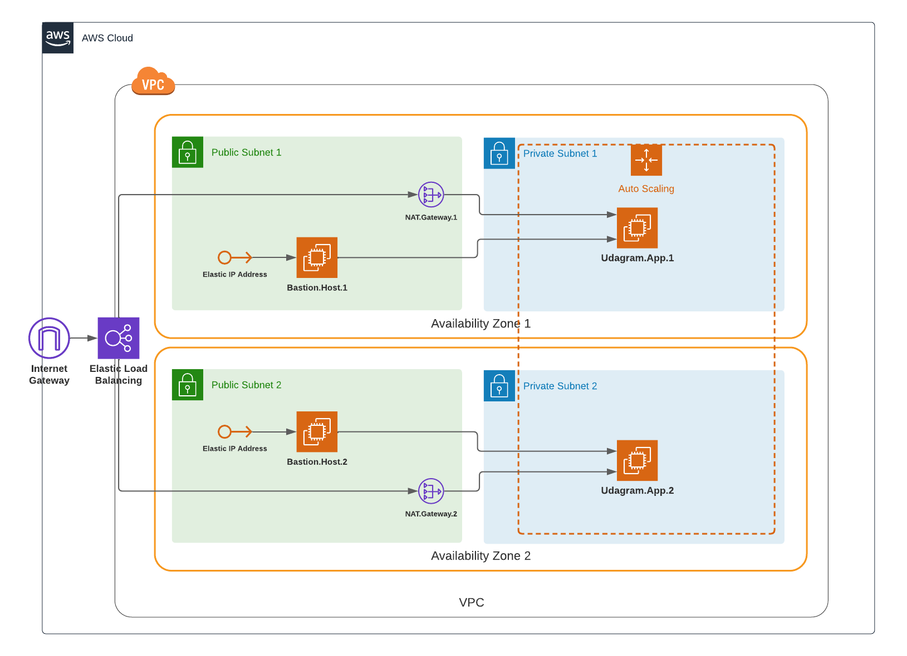

# Udagram - Deploy a high-availability web app using CloudFormation

Infrastructure as Code scripts using CloudFormation to deploy a dummy application (a sample JavaScript or HTML file) to the Apache Web Server running on an EC2 instance.

## Dependencies

- AWS Account
- AWS CLI
- Bash Terminal or [Cmder](https://cmder.net/)

## Scenario

Developers want to deploy a new application to the AWS infrastructure.
You have been tasked with provisioning the required infrastructure and deploying a dummy application, along with the necessary supporting software.
This needs to be automated so that the infrastructure can be discarded as soon as the testing team finishes their tests and gathers their results.

**Optional** - To add more challenge to the project, once the project is completed, you can try deploying sample website files located in a public S3 Bucket to the Apache Web Server running on an EC2 instance. Though, it is not the part of the project rubric.

## Architecture

AWS Infrastructure created in CloudFormation scripts



## IaC CloudFormation

Scripts are included in `templates` directory, they are created generic to be reusable in later common infrastructure creation.

### Stacks

The following list shows CloudFormation stacks created:
- udagram-vpc
- udagram-single-az-1
- udagram-single-az-2
- bastion-security
- udagram-security
- udagram-server
- bastion-instance-1
- bastion-instance-2

Some stacks are created under the same template by using different parameters, such as:
- udagram-single-az
- bastion-instance

#### Create Stacks

To create stacks you can run the following bash script:
```bash
./submit-stack.sh create us-west-2
```
It creates them sequentially as configured/ordered in `stacks.lst`, and waits for each stack to be completed before creating the other to manage dependencies in the order of creation.

or by running the below command for each stack, as the below example:
```bash
aws cloudformation create-stack \
--stack-name udagram-vpc \
--template-body file://templates/network/udagram-vpc/udagram-vpc.yaml \
--parameters file://templates/network/udagram-vpc/parameters/udagram-vpc-parameters.json \
--region us-west-2 --capabilities CAPABILITY_NAMED_IAM
```

### Update Stacks

To update stacks you can run the following bash script:
```bash
./submit-stack.sh update us-west-2
```
or by running the below command for each stack, as the below example:
```bash
aws cloudformation update-stack \
--stack-name udagram-vpc \
--template-body file://templates/network/udagram-vpc/udagram-vpc.yaml \
--parameters file://templates/network/udagram-vpc/parameters/udagram-vpc-parameters.json \
--region us-west-2 --capabilities CAPABILITY_NAMED_IAM
```
